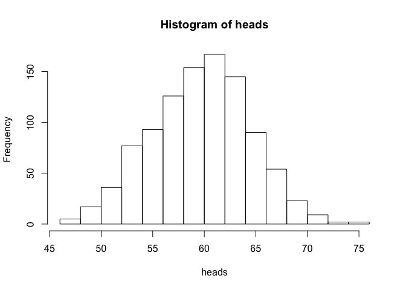
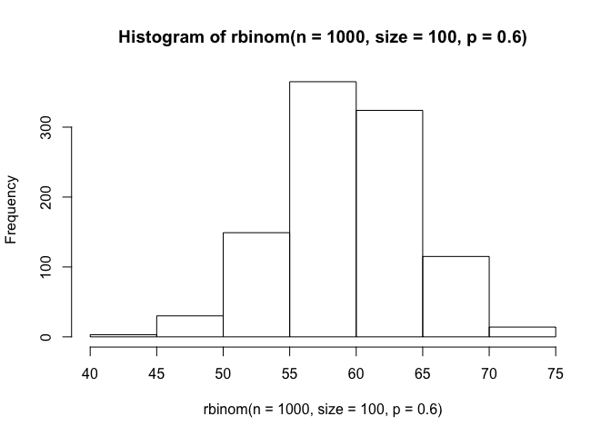
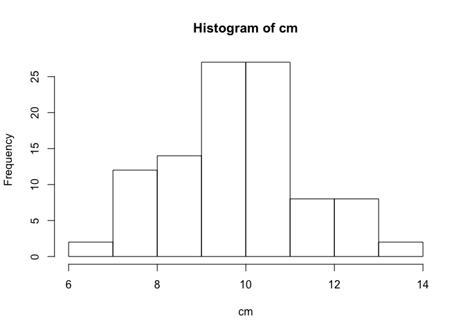
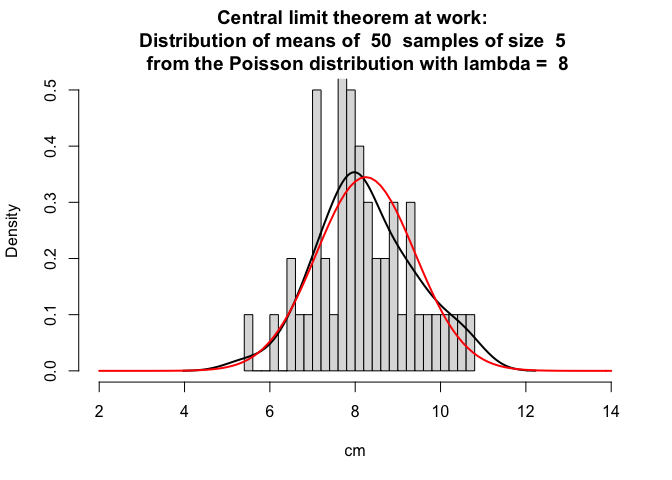
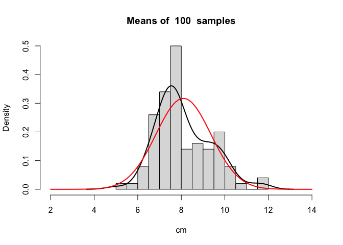
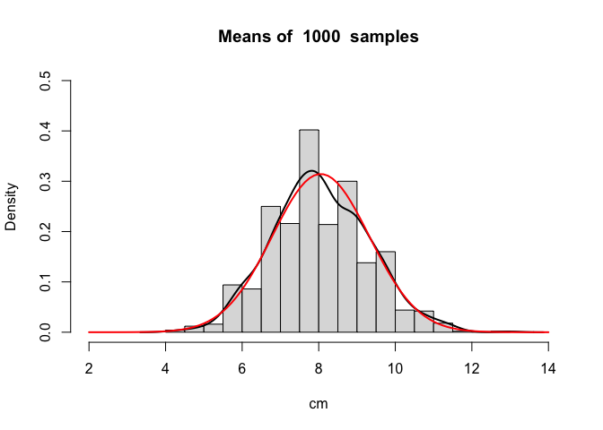
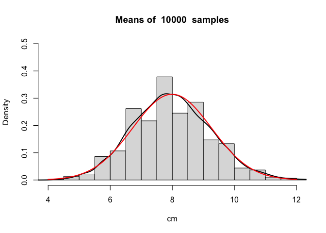

# R Tips & Tricks
Julia Ponomarenko, CRG Bioinformatics core.  
Dec 27, 2017  
<br/>

* Nice R tutorial
http://journals.plos.org/ploscompbiol/article/file?id=10.1371/journal.pcbi.1000482.s001&type=supplementary
* R swirl tutorials https://github.com/swirldev/swirl_courses. Basic one was used here.
<br/>

The example dataset used in this tutorial (Davis from the package car)
------------------

```r
#install.packages("car")
library(car)
data <- Davis
```

<br/>

Files and Directories
--------------------------

```r
getwd() # current directory - This is directory where this file is located
```

```
## [1] "/Users/jpon/R_Tips"
```

```r
# to set up this directory as a working in console
dir <- getwd()
setwd(dir) # run it in console, not from inside the notebook

file.info("R_Tips.Rmd")
```

```
## Warning in as.POSIXlt.POSIXct(x, tz): unknown timezone 'zone/tz/2017c.1.0/
## zoneinfo/Europe/Madrid'
```

```
##             size isdir mode               mtime               ctime
## R_Tips.Rmd 18050 FALSE  644 2018-01-02 14:47:50 2018-01-02 14:47:50
##                          atime uid gid uname grname
## R_Tips.Rmd 2018-01-02 14:47:51 501  20  jpon  staff
```

```r
file.info("R_Tips.Rmd")$ctime 
```

```
## [1] "2018-01-02 14:47:50 GMT"
```

```r
list.files()
```

```
## [1] "Davis"        "Figures"      "R_Tips_files" "R_Tips.html" 
## [5] "R_Tips.md"    "R_Tips.Rmd"   "R_Tips.Rproj" "README.md"
```

```r
dir.create("testdir", showWarnings = F)
setwd("testdir") # run in console
file.create("mytest.R")
```

```
## [1] TRUE
```

```r
file.exists("mytest.R")
```

```
## [1] TRUE
```

```r
file.rename("mytest.R","mytest2.R")
```

```
## [1] TRUE
```

```r
file.copy("mytest2.R","mytest3.R")
```

```
## [1] TRUE
```

```r
list.files()
```

```
## [1] "mytest2.R" "mytest3.R"
```

```r
# get full paths of all files and directories containing "R" or "r" in the directory dir
filenames <- list.files(dir, pattern = "*R*", full.names = TRUE, recursive = TRUE, ignore.case = TRUE, include.dirs = TRUE) 
Dir_separator <- "/" # for Windows it is "\"
file_name <- as.character(lapply(strsplit(filenames[1], Dir_separator), tail, n = 1)) # to get just the file name, for example
# while full.names = FALSE in list.files()does the same without the need to parse filenames

list.dirs() # also useful command when looping via directories is needed
```

```
## [1] "."
```

```r
dir.create(file.path('testdir2', 'testdir3'), recursive = TRUE)
setwd("..") # one directory up
unlink("testdir", recursive = T)  #removes testdir and all folders inside
```
<br/>


Read files
-----------

```r
file <- "R_Tips.Rmd"
x <- read.table(file, skip = 7, nrows = 1) # for example, we read only line 8
x <- as.numeric(x[2]) # for example, we need a value of the 2nd element of the vector x

# let's write data to the file with the description lines on top
file <- "Davis"
conn <- file(file, open = "w")
writeLines("This is the dataset Davis from the package car", conn)
write("This is my favorite dataset", conn, append = TRUE)
close(conn)

conn <- file(file, open = "a")
write.table(data, conn, row.names = FALSE) # can be write.csv()
close(conn)

#to read a data frame 
conn <- file(file, open = "r")
df <- read.table(conn, skip = 2, header = TRUE) # can be read.csv()
close(conn)
```
<br/>


Data structures: Sequences, Numbers, Vectors, Matrices, Lists  
-----------

```r
w <<- 10 # assign w to a global environment ???

6.03 / 2
```

```
## [1] 3.015
```

```r
6.03 %/% 2 # integer division
```

```
## [1] 3
```

```r
6.03 %% 2 # getting remainder
```

```
## [1] 0.03
```

```r
my_seq <- seq(5,10,length=30)
my_seq
```

```
##  [1]  5.000000  5.172414  5.344828  5.517241  5.689655  5.862069  6.034483
##  [8]  6.206897  6.379310  6.551724  6.724138  6.896552  7.068966  7.241379
## [15]  7.413793  7.586207  7.758621  7.931034  8.103448  8.275862  8.448276
## [22]  8.620690  8.793103  8.965517  9.137931  9.310345  9.482759  9.655172
## [29]  9.827586 10.000000
```

```r
# all three below are identical
1:length(my_seq)
```

```
##  [1]  1  2  3  4  5  6  7  8  9 10 11 12 13 14 15 16 17 18 19 20 21 22 23
## [24] 24 25 26 27 28 29 30
```

```r
seq(along.with = my_seq)
```

```
##  [1]  1  2  3  4  5  6  7  8  9 10 11 12 13 14 15 16 17 18 19 20 21 22 23
## [24] 24 25 26 27 28 29 30
```

```r
seq_along(my_seq)
```

```
##  [1]  1  2  3  4  5  6  7  8  9 10 11 12 13 14 15 16 17 18 19 20 21 22 23
## [24] 24 25 26 27 28 29 30
```

```r
# notice difference!
rep(c(1,2,3), times = 10)
```

```
##  [1] 1 2 3 1 2 3 1 2 3 1 2 3 1 2 3 1 2 3 1 2 3 1 2 3 1 2 3 1 2 3
```

```r
rep(c(1,2,3), each = 10)
```

```
##  [1] 1 1 1 1 1 1 1 1 1 1 2 2 2 2 2 2 2 2 2 2 3 3 3 3 3 3 3 3 3 3
```

```r
x <- c(1,2,3,4,5,6)
y <- x > 3 # boolean vector

chars <- c("my", "name", "is")
x <- paste(chars, collapse = " ") # concatenate vector
paste("my", "name", "is", sep = " ") # same as above, but not paste(chars, sep = " ")
```

```
## [1] "my name is"
```

```r
# Careful: paste with vectors recycles the shorter vector
paste(LETTERS, 1:4, sep = "-") # output is a vector!
```

```
##  [1] "A-1" "B-2" "C-3" "D-4" "E-1" "F-2" "G-3" "H-4" "I-1" "J-2" "K-3"
## [12] "L-4" "M-1" "N-2" "O-3" "P-4" "Q-1" "R-2" "S-3" "T-4" "U-1" "V-2"
## [23] "W-3" "X-4" "Y-1" "Z-2"
```

```r
# random sampling from vectors without replacement
y <- rnorm(1000)
z <- rep(NA, 1000)
my_data <- sample(c(y, z), 100)
my_na <- is.na(my_data)
sum(my_na) # how many NAs
```

```
## [1] 53
```

```r
x <- my_data
y <- x[!is.na(x)]
y[y > 0]
```

```
##  [1] 0.54399780 0.29844471 0.16166920 0.54393772 0.92362187 0.76989513
##  [7] 1.74918185 1.24186773 1.77120167 0.32720393 1.02815249 0.20482041
## [13] 1.47819291 1.10687209 0.75079862 0.96390522 2.28152215 0.03696307
## [19] 0.22763205 1.88153435 0.22512108 1.10843293 1.32586840 1.17389049
## [25] 0.08589314 0.48220699 2.65043731
```

```r
x[!is.na(x) & x > 0] # same as above
```

```
##  [1] 0.54399780 0.29844471 0.16166920 0.54393772 0.92362187 0.76989513
##  [7] 1.74918185 1.24186773 1.77120167 0.32720393 1.02815249 0.20482041
## [13] 1.47819291 1.10687209 0.75079862 0.96390522 2.28152215 0.03696307
## [19] 0.22763205 1.88153435 0.22512108 1.10843293 1.32586840 1.17389049
## [25] 0.08589314 0.48220699 2.65043731
```

```r
x[x > 0] # gives NA for NA because NA > 0 = NA
```

```
##  [1]         NA         NA         NA         NA 0.54399780         NA
##  [7]         NA 0.29844471 0.16166920         NA         NA         NA
## [13]         NA 0.54393772         NA 0.92362187 0.76989513         NA
## [19]         NA 1.74918185         NA         NA         NA 1.24186773
## [25] 1.77120167         NA 0.32720393 1.02815249         NA         NA
## [31] 0.20482041         NA 1.47819291 1.10687209         NA         NA
## [37]         NA         NA 0.75079862         NA         NA         NA
## [43]         NA         NA         NA         NA 0.96390522         NA
## [49] 2.28152215         NA 0.03696307         NA         NA 0.22763205
## [55]         NA         NA         NA         NA         NA         NA
## [61] 1.88153435         NA 0.22512108         NA         NA 1.10843293
## [67] 1.32586840 1.17389049         NA         NA 0.08589314         NA
## [73] 0.48220699         NA         NA         NA         NA         NA
## [79] 2.65043731         NA
```

```r
# NaN stand for "not a number"
# Inf stand for infinity

my_vector <- 1:20
dim(my_vector) <- c(4, 5) # dim allows both to get and set the 'dim' attribute to make a vector to a matrix
attributes(my_vector)
```

```
## $dim
## [1] 4 5
```

```r
class(my_vector)
```

```
## [1] "matrix"
```

```r
my_matrix <- my_vector

my_matrix2 <- matrix(data = 1:20, nrow = 4)
identical(my_matrix, my_matrix2)
```

```
## [1] TRUE
```

```r
# naming matrix rows and columns
patients <- c("Bill", "Gina", "Kelly", "Sean") # are in rows
cbind(patients,my_matrix) # numbers in my_matrix are implicitly coerced in characters!
```

```
##      patients                       
## [1,] "Bill"   "1" "5" "9"  "13" "17"
## [2,] "Gina"   "2" "6" "10" "14" "18"
## [3,] "Kelly"  "3" "7" "11" "15" "19"
## [4,] "Sean"   "4" "8" "12" "16" "20"
```

```r
my_data <- data.frame(patients, my_matrix) # so, use a data.frame instead
cnames <- c("patient", "age", "weight", "bp", "rating", "test")
colnames(my_data) <- cnames

# which() function finds the indices:
ints <- sample(10)
which(ints > 7)
```

```
## [1] 3 5 7
```

```r
any(ints < 0)
```

```
## [1] FALSE
```

```r
all(ints > 0)
```

```
## [1] TRUE
```

#### Lists

```r
l <- list(id = "Joe", age = 25, dob = c(1980, 3, 29))
l$id
```

```
## [1] "Joe"
```

```r
l[[1]]
```

```
## [1] "Joe"
```

```r
l["id"] <- "Jim" #change element
l["age"] <- NULL # drop element
```

#### Operators &, &&, | and ||

```r
#the `&` operator to evaluate AND across a vector:
TRUE & c(TRUE, FALSE, FALSE)
```

```
## [1]  TRUE FALSE FALSE
```

```r
#The `&&` version of AND only evaluates the first member of a vector:
TRUE && c(TRUE, FALSE, FALSE)
```

```
## [1] TRUE
```

```r
#The OR operator follows a similar set of rules. The `|` version of OR evaluates OR across an entire vector, while the `||` version of OR only evaluates the first member of a vector.
TRUE | c(TRUE, FALSE, FALSE)
```

```
## [1] TRUE TRUE TRUE
```

```r
#All AND operators are evaluated before OR operators

isTRUE(6 > 4)
```

```
## [1] TRUE
```

```r
xor(5 == 6, !FALSE)
```

```
## [1] TRUE
```
<br/>


Functions
-----------
Type the function name to see its source code.
Use args(function_name) to see the function arguments
<br/>


#### Function can be passed as an argument to other functions

```r
evaluate <- function(func, dat){
  return(func(dat))
}
evaluate(sd, c(1.4, 3.6, 7.9, 8.8))
```

```
## [1] 3.514138
```

```r
evaluate(function(x){x+1}, 6)
```

```
## [1] 7
```

```r
evaluate(function(x){x[1]}, c(8, 4, 0))
```

```
## [1] 8
```

```r
evaluate(function(x){x[length(x)]}, c(8, 4, 0)) # accessing the last element
```

```
## [1] 0
```
<br/>


#### Ellipses
Use ellipsis when the function calls the variable number of arguments, see https://www.r-bloggers.com/r-three-dots-ellipsis/

The ellipses can be used to pass on arguments to other functions that are
used within the function. Usually a function that has the
ellipses as an argument has the ellipses as the last argument. The usage of
such a function would look like
__ellipses_func(arg1, arg2 = TRUE, ...)__
<br/>
However, the usage for the paste() function is as follows:
__paste(..., sep = " ", collapse = NULL)__,
where the ellipses is the first argument, and all other arguments after the ellipses have default values. __This is a strict rule in R programming: all arguments after an ellipses must have default values. __

```r
telegram <- function(...){
  args <- list(...)
  txt <- paste(args, collapse = " ")
  paste("START", txt, "STOP", collapse = " ")
}
telegram("I", "want", "to eat")
```

```
## [1] "START I want to eat STOP"
```

```r
telegram2 <- function(...){
  args <- list(...)
  #extract named arguments from the args list by the name of the argument and double brackets: 
  who <- args[["who"]]
  verb <- args[["verb"]]
  what <- args[["what"]]
  paste("The person", who, "decided that she", verb, "to do the following", what)
}
telegram2(who = "I", verb = "want", what = "to eat")
```

```
## [1] "The person I decided that she want to do the following to eat"
```

<br/>


Vectorization - Looping through an entire vector
--------------------------

```r
x <- runif(100) # a vector of uniformly distributed 100 values
y <- ifelse(x > 0.5, 1, 0) 
```
<br/>


Q. Flip a biased coin [p=0.6 of heads] 100 times; how many heads do you get? Repeat this for 1000 trials.

```r
x <- replicate(1000, rbinom(n = 100, size = 1, p = 0.6))
heads <- colSums(x)
hist(heads)
```

<!-- -->

```r
# or the same
hist(rbinom(n = 1000, size = 100, p = 0.6))
```

<!-- -->
<br/>


Q. Fibonacci sequence (0, 1, 1, 2, 3, 5, 8, 13, 21,...). 
Wite a function that returns the n-th element in the sequence

```r
fibo <- function(n){
  x1 <- 0
  x2 <- 1
  if (n == 1) return(x1)
  if (n == 2) return(x2)
  for (i in 3:n) {
    x3 <- x1 + x2
    x1 <- x2
    x2 <- x3
    }
  return(x3)
}
system.time(o1 <- fibo(10000))
```

```
##    user  system elapsed 
##   0.005   0.000   0.004
```

```r
# more R-style solution using a recursive function 
fi <- function(n){
  if (n == 1) return(0)
  if (n == 2) return(1)
  fi(n-1) + fi(n-2)
}

# however, the latter function is terribly slow - compare execution time!!
system.time(o1 <- fibo(30))
```

```
##    user  system elapsed 
##   0.000   0.000   0.001
```

```r
system.time(o2 <- fi(30))
```

```
##    user  system elapsed 
##   1.304   0.016   1.331
```

<br/>


#### lapply() and sapply() are for lists and vectors
These powerful functions, along with their close relatives vapply() and tapply(), among others, offer a concise and convenient means of implementing the Split-Apply-Combine strategy for data analysis.

The lapply() function (l stands for list) takes a list as input, applies a function to each element of the list, then returns a list of the same length as the original one. Since a data frame is just a list of vectors (you can see this with as.list(data)), we can use lapply() to apply the class() function to each column of the dataset. 

```r
cls_list <- lapply(data, class)
cls_vect <- as.character(cls_list) # chacter vector

cls_vect <- sapply(data, class) # sapply (s stands for simplifying the output) allows to get the above in one command

#calculate mean for each column with numbers
lapply(data[,2:5], mean, na.rm = TRUE) # NA needs to be omitted
```

```
## $weight
## [1] 65.8
## 
## $height
## [1] 170.02
## 
## $repwt
## [1] 65.62295
## 
## $repht
## [1] 168.4973
```

```r
sapply(data[,2:5], mean, na.rm = TRUE) # to get a vector
```

```
##    weight    height     repwt     repht 
##  65.80000 170.02000  65.62295 168.49727
```

```r
sapply(data[,2:5], mean, na.rm = TRUE, simplify = F) # to get a list as in lapply
```

```
## $weight
## [1] 65.8
## 
## $height
## [1] 170.02
## 
## $repwt
## [1] 65.62295
## 
## $repht
## [1] 168.4973
```

```r
#However if lapply returns list of vectors, e.g.
lapply(data[,2:5], range, na.rm = TRUE)
```

```
## $weight
## [1]  39 166
## 
## $height
## [1]  57 197
## 
## $repwt
## [1]  41 124
## 
## $repht
## [1] 148 200
```

```r
# then sapply returns the matrix
sapply(data[,2:5], range, na.rm = TRUE)
```

```
##      weight height repwt repht
## [1,]     39     57    41   148
## [2,]    166    197   124   200
```

```r
# what if lapply returns vectors of different length?
unique_vals <- lapply(data, unique, na.rm = TRUE)
sapply(unique_vals, length)
```

```
##    sex weight height  repwt  repht 
##      2     54     43     54     33
```

```r
# then sapply returns the list, same as lapply
sapply(data, unique, na.rm = TRUE)
```

```
## $sex
## [1] M F
## Levels: F M
## 
## $weight
##  [1]  77  58  53  68  59  76  69  71  65  70 166  51  64  52  92  62  61
## [18] 119  66  54  50  63  39 101  75  79  56  88  80  78  85  73  49  82
## [35]  74 102  57  97  60  55  84 103  47  45  67  83  96  44  87  90  48
## [52]  81  43  89
## 
## $height
##  [1] 182 161 177 157 170 167 186 178 171 175  57 168 163 166 187 197 180
## [18] 173 169 183 164 176 174 179 160 162 165 185 172 189 158 184 159 155
## [35] 152 153 148 188 191 150 154 181 156
## 
## $repwt
##  [1]  77  51  54  70  59  76  73  71  64  75  56  52  57  66 101  62  61
## [18] 124  50  60  41 100  63  65  69  86  67  53  80  82  55  NA  85 107
## [35]  74  58  98  68  87  47  45  90  79  83  94  44  89  84  91  95  78
## [52]  49  93  81
## 
## $repht
##  [1] 180 159 158 175 155 165 170 174 163 160 185 200 171 178 173 168 153
## [18] 161 188  NA 183 172 169 150 182 154 164 179 181 148 176 152 166
```

```r
# using lapply() with an anonymous function, e.g. to get the first unique elements
lapply(unique_vals, function(x) x[1])
```

```
## $sex
## [1] M
## Levels: F M
## 
## $weight
## [1] 77
## 
## $height
## [1] 182
## 
## $repwt
## [1] 77
## 
## $repht
## [1] 180
```
<br/>


#### vapply() returns a vector explicitly, while sapply() tries to guess the output format

```r
vapply(data, class, character(1)) # this might be a safe option to use in a running script rather than playing with data interactively
```

```
##       sex    weight    height     repwt     repht 
##  "factor" "integer" "integer" "integer" "integer"
```
<br/>


#### tapply() splits data up into groups based on the value of the 2nd listed variable, then applies a function to the members of each group

```r
tapply(data$weight, data$sex, summary) # summary of weights by sex
```

```
## $F
##    Min. 1st Qu.  Median    Mean 3rd Qu.    Max. 
##   39.00   52.75   56.00   57.87   62.00  166.00 
## 
## $M
##    Min. 1st Qu.  Median    Mean 3rd Qu.    Max. 
##   54.00   67.75   75.00   75.90   83.00  119.00
```

<br/>


#### apply() is for matrices and data frames

```r
apply(data[,2:5], 2, mean, na.rm = TRUE) # returns a vector of means by columns
apply(data[,2:5], 1, mean, na.rm = TRUE) # returns a vector of means by rows
df <- data[apply(data[,2:5], 1, sum, na.rm = TRUE) > 500,] # select rows with sum above 500

apply(data, 2, function(x) length(unique(na.omit(x)))) # count unique values in each column, omitting NA

apply(data[,2:5], 1, function(x) length(x[x < 80])) # how many values below 80 each row has 
apply(data, 2, function(x) class(x))
```
<br/>

Exploring data
-------------------------

```r
object.size(data) # size of a dataset
```

```
## 16768 bytes
```

```r
summary(data)
```

```
##  sex         weight          height          repwt            repht      
##  F:112   Min.   : 39.0   Min.   : 57.0   Min.   : 41.00   Min.   :148.0  
##  M: 88   1st Qu.: 55.0   1st Qu.:164.0   1st Qu.: 55.00   1st Qu.:160.5  
##          Median : 63.0   Median :169.5   Median : 63.00   Median :168.0  
##          Mean   : 65.8   Mean   :170.0   Mean   : 65.62   Mean   :168.5  
##          3rd Qu.: 74.0   3rd Qu.:177.2   3rd Qu.: 73.50   3rd Qu.:175.0  
##          Max.   :166.0   Max.   :197.0   Max.   :124.00   Max.   :200.0  
##                                          NA's   :17       NA's   :17
```

```r
str(data)
```

```
## 'data.frame':	200 obs. of  5 variables:
##  $ sex   : Factor w/ 2 levels "F","M": 2 1 1 2 1 2 2 2 2 2 ...
##  $ weight: int  77 58 53 68 59 76 76 69 71 65 ...
##  $ height: int  182 161 161 177 157 170 167 186 178 171 ...
##  $ repwt : int  77 51 54 70 59 76 77 73 71 64 ...
##  $ repht : int  180 159 158 175 155 165 165 180 175 170 ...
```

```r
table(data$sex)
```

```
## 
##   F   M 
## 112  88
```

<br/>


Sampling
------------------

```r
sample(1:6, 4, replace = TRUE) # simulate rolling four six-sided dice
```

```
## [1] 4 5 3 5
```

```r
sample(LETTERS, 5) # w/o replacement
```

```
## [1] "Q" "B" "V" "C" "F"
```

```r
flips <- sample(c(0, 1), 100, replace = TRUE, prob = c(0.3, 0.7)) #flipping unfair coin 100 times
sum(flips)
```

```
## [1] 82
```

```r
flips2 <- rbinom(n = 100, size = 1, prob = 0.7) # same as above
sum(flips2)
```

```
## [1] 75
```

```r
rnorm(10, mean = 100, sd = 25)
```

```
##  [1] 105.40993 110.79797 109.17074  97.56526 144.73061  77.31087 104.95054
##  [8] 101.31248  62.96104 111.04215
```

```r
my_pois <- replicate(100, rpois(5, 10)) # outputs a matrix, each column of which contains 5 random numbers generated from a Poisson distribution with lambda (or mean) of 10
cm <- colMeans(my_pois)
hist(cm) # Central limit theoreme at work!
```

<!-- -->
<br/>


Debugging in R
-------------------
* traceback()
* Use browser() to single-step through your code. Place it within your function at the point you want to examine (e.g.) local variables.
* Use debug(function.name) to step through entire function. undebug() will remove that debug call.
* recover() is like browser, except you can choose which level to inspect, rather than the level at which browser was called.
* Add warnings and errors to your code using warning(), stop().
* Can add “assertions” into your code to check that certain values hold; e.g.,
stopifnot (x>0)
* debug(fn), undebug(fn)
<br/>


Running R scripts in command line
-----------------
* At the command line, type “R CMD BATCH trig.R”. R will start up,
process your commands and then quit.
* Output is stored in the file trig.Rout
* If there were no errors, the last line of the output file shows the time taken to run the script.
* to run a script, use source(’ trig .R’, echo=T) to see commands and output

<br/>


Using GitHub from R studio
----------------------------
http://happygitwithr.com/new-github-first.html provides instruction how to setup R studio to use with git and Github.

#### “GitHub first, then RStudio” sequence for each new project

* In github browser, create a new repo, with README.
* In R Studio, start a new RStudio Project, via File > New Project > Version Control > Git, opening a new session and creating a new folder on your computer.
* Using Git tab on the right panel, do commit of all valuable changes in local git repository.
* Once ready, push local changes to GitHub, but first, to synchronize with local git repo, pull the current version from GitHub, pushing the blue button "Pull", and then the green button "Push".

<br/>

Using R markdown in github
--------
After http://happygitwithr.com/rmd-test-drive.html
The magical process that turns your R Markdown to HTML is like so: foo.Rmd --> foo.md --> foo.html. Note the intermediate markdown, foo.md. By default RStudio discards this, but you might want to hold on to that markdown.

Why? GitHub gives very special treatment to markdown files. They are rendered in an almost HTML-like way. This is great because it preserves all the charms of plain text but gives you a pseudo-webpage for free when you visit the file in the browser. In contrast, HTML is rendered as plain text on GitHub and you’ll have to take special measures to see it the way you want.

Add in output at the top of Rmd file "keep_md: true"

By making foo.Rmd available, others can see and run your actual code. By sharing foo.md and/or foo.html, others can casually browse your end product and decide if they even want to bother.

* Add figures on GitHub md-document, using for example, ```{r, CLT_50_samples, fig.path='Figures/'} and commiting the folder Figures as well (that is the whole folder with the project)

```r
n_sample <- 50
lambda <- 8
size <- 5
my_pois <- replicate(n_sample, rpois(size, lambda)) # outputs a matrix, each column of which contains 5 random numbers generated from a Poisson distribution with lambda (or mean) of 10
cm <- colMeans(my_pois)
title <- paste("Central limit theorem at work: \nDistribution of means of ",  n_sample, " samples of size ", size, "\n from the Poisson distribution with lambda = ", lambda)
hist(cm, col = "gainsboro", ylim = c(0, 0.5), xlim = c(2,14), main = title, freq = F, breaks = 20)
lines(density(cm), lwd = 2)
curve(dnorm(x, mean = mean(cm), sd = sd(cm)), col = "red", lwd = 2, add = T)
```

<!-- -->

<br/>

<!-- -->

<!-- -->

<!-- -->

<br/>

Rmd files
-----------------------
* Add a new chunk by clicking the *Insert Chunk* button on the toolbar or by pressing *Cmd+Option+I*.

* In-line code is used like this: In this tutorial, we are using the dataset with 200 data point and 5 variables.

* Name the chunk, like ```{r chunk_name}. This is useful for looking for errors and for figures that will have names based on the name of the chunk

* To pull all of the R code from the Rmd file, use purl("test.Rmd")

* Extract R code and include documentation, use purl("test.Rmd", output = "test.R", documentation = 2)

* To echo the code (but don't run it) from an external script called myscript.R in the Rmarkdown, use {r, code = readLines("myscript.R")} 

* Not to show the code, but show the results, use echo = FALSE.

* Not to show the results, but show the code and the figures, use results = "hide".

* Evaluate the chunk but not to show the code and the result, use include = FALSE.

* To hide figure, use fig.show="hide".

* include=FALSE, all of the code, results, and figures will be suppressed.

* warning=FALSE and message=FALSE suppress any R warnings or messages from being included in the final document.

* fig.path='Figs/' makes it so the figure files get placed in the Figs subdirectory. (By default, they are not saved at all.)

* When you save the notebook, an HTML file containing the code and output will be saved alongside it (click the *Preview* button or press *Cmd+Shift+K* to preview the HTML file).
